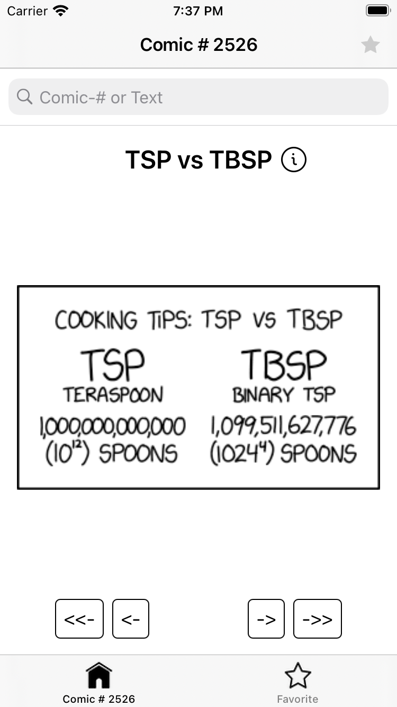

# xkcd-shortcut-challange 
*** note search api is not working

### Pods
- SwiftLint
- TinyConstraints

### Completed Features
- Read comic
User can read the comic as it is on screen or could also use pinch-zoom gesture to make it bigger!

- Browse comics
User always sees the most recent comic when opening the app User can navigate through comics using the buttons previous and next User can jump to first/last comic using the corresponding buttons

- Search Comic ( API not working :D )

- Favorite Comic
User can favorite any comic by tapping on the star-icon on the top-right corner, and the id of the comic is stored on device till the user deletes the application.

- See Explanation
User can tap on the info-icon in front of the comic-title to read comic's explanation which opens in safari-controller
- unit test for main modules 

### Main Layers

Project written in Swift 5 code built using the MVVM

ViewModel - view - model - Network Layer - Caching 

### Architecture:
MVVM design pattern :

Model is a class that declares properties for managing business data

View is represented by the UIView or UIViewController objects, accompanied with their .xib and .storyboard files, which should only display prepared data.

ViewModel The viewModel is at the heart of the MVVM design pattern and provides the connection between the business logic and the view/view controller. The view (UI) responds to user input by passing input data (defined by the model) to the viewModel. In turn, the viewModel evaluates the input data and responds with an appropriate UI presentation according business logic workflow.

